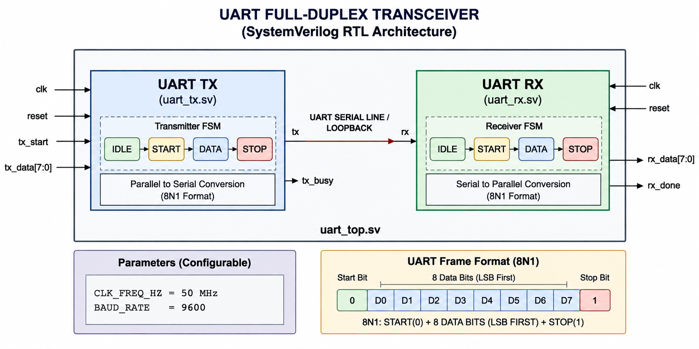
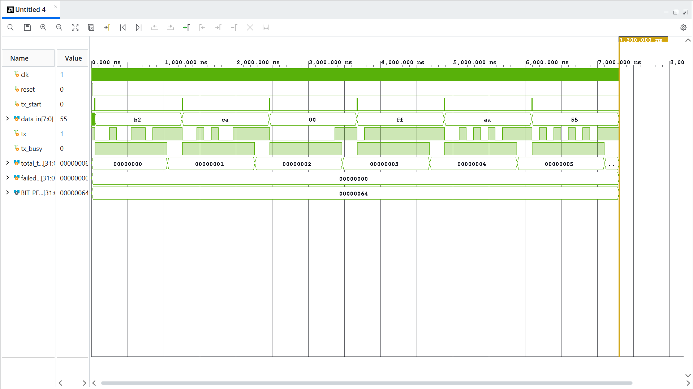
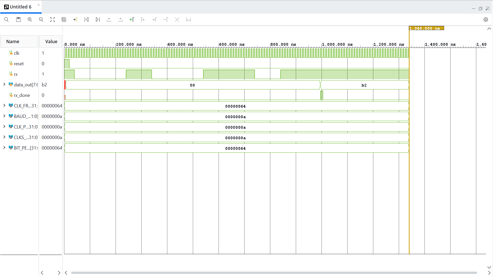
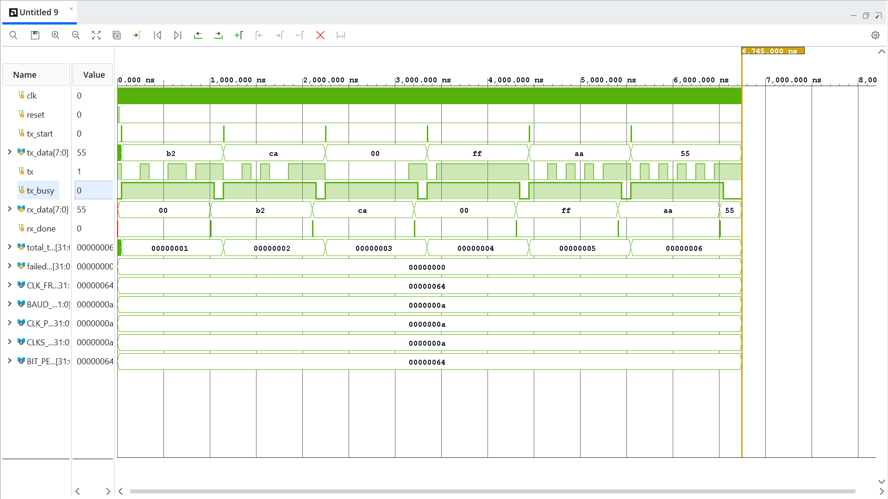
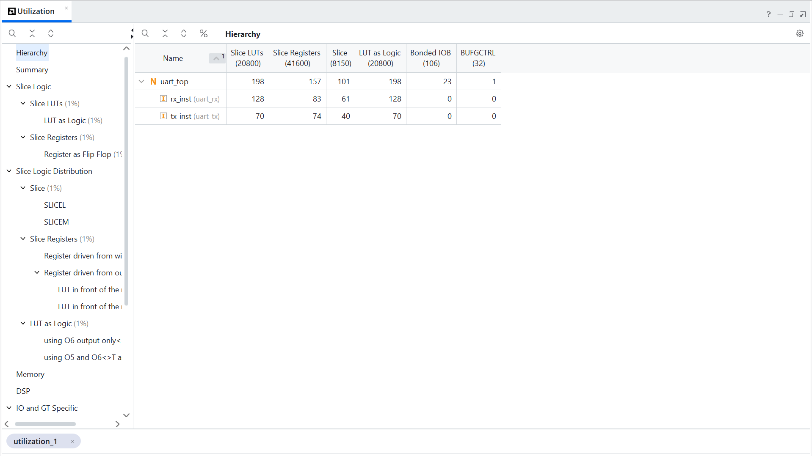
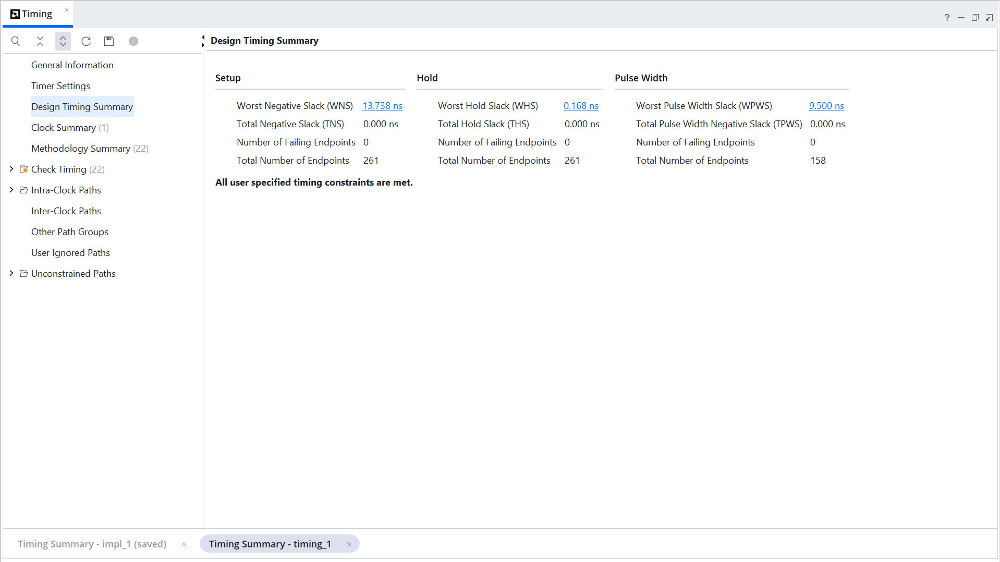

# UART Full-Duplex Transceiver — Documentation

This directory contains the architecture diagram, simulation waveforms, and FPGA synthesis/implementation results for the UART Full-Duplex Transceiver project.

---

# RTL Architecture



The architecture consists of independent parameterized UART transmitter and receiver FSMs integrated through `uart_top.sv`.

The diagram illustrates:

- Parallel-to-serial TX conversion
- Serial-to-parallel RX conversion
- UART 8N1 framing
- TX and RX finite state machines
- Clock and reset inputs
- Configurable clock frequency and baud rate
- Full-duplex loopback connection
- TX and RX interfaces

---

# UART Configuration

| Parameter | Configuration |
|---|---|
| Data Bits | 8 |
| Parity | None |
| Stop Bits | 1 |
| Format | 8N1 |
| Data Order | LSB First |
| Clock Frequency | 50 MHz |
| Baud Rate | 9600 |

---

# Simulation Results

The UART design was verified using AMD Vivado XSim.

Three main simulation stages were performed:

1. Transmitter verification
2. Receiver verification
3. Full-duplex loopback verification

---

## TX Waveform



The transmitter waveform demonstrates the generation of:

```text
Idle → Start Bit → 8 Data Bits → Stop Bit
```

The data is transmitted LSB first.

### TX Test Result

```text
Test Patterns:
B2
CA
00
FF
AA
55

Total Tests : 6
Failed Tests: 0

STATUS: PASS
```

---

# RX Waveform



The receiver detects the start bit, validates it near the middle of the bit period, samples the eight data bits, validates the stop bit, and generates an `rx_done` pulse after successful reception.

### RX Test Result

```text
Valid Test Patterns:
B2
CA
00
FF
AA
55

Valid Tests : 6
Failed Tests: 0

Invalid Stop-Bit Test:
PASS
```

---

# Full-Duplex Waveform



The complete UART system was verified using a direct loopback connection:

```systemverilog
assign rx = tx;
```

This connects the transmitter serial output directly to the receiver serial input.

### Full-Duplex Test Result

```text
Test Patterns:

10110010
11001010
00000000
11111111
10101010
01010101

Total Tests : 6
Failed Tests: 0

STATUS: PASS
```

---

# FPGA Implementation

The design was synthesized and implemented using AMD Vivado.

### Target Device

```text
FPGA Family : Artix-7
Device      : xc7a35tcpg236-1
```

Synthesis and implementation completed successfully.

---

# Resource Utilization



The post-implementation resource utilization was:

| Resource | Used | Available |
|---|---:|---:|
| Slice LUTs | 198 | 20,800 |
| Slice Registers | 157 | 41,600 |
| Slices | 101 | 8,150 |
| LUT as Logic | 198 | 20,800 |
| Bonded IOB | 23 | 106 |
| BUFGCTRL | 1 | 32 |

The UART design occupies a relatively small portion of the available Artix-7 resources.

---

# Timing Analysis



Static timing analysis was performed after implementation.

| Timing Metric | Result |
|---|---:|
| WNS | 13.738 ns |
| TNS | 0.000 ns |
| Failing Setup Endpoints | 0 |
| WHS | 0.168 ns |
| THS | 0.000 ns |
| Failing Hold Endpoints | 0 |
| WPWS | 9.500 ns |
| Total Pulse Width Negative Slack | 0.000 ns |
| Failing Pulse Width Endpoints | 0 |

Vivado reported that all user-specified timing constraints were met.

---

# Verification Summary

| Stage | Result |
|---|---|
| UART TX Simulation | PASS |
| UART RX Simulation | PASS |
| Invalid Stop-Bit Test | PASS |
| Full-Duplex Loopback | PASS |
| Synthesis | PASS |
| Implementation | PASS |
| Timing Analysis | PASS |

---

# Documentation Files

This directory contains:

| File | Description |
|---|---|
| `rtl_architecture.png` | UART RTL architecture/block diagram |
| `tx_waveform.png` | UART transmitter simulation waveform |
| `rx_waveform.png` | UART receiver simulation waveform |
| `full_duplex_waveform.png` | Full-duplex loopback simulation waveform |
| `utilization.png` | Vivado post-implementation resource utilization |
| `timing_summary.png` | Vivado static timing analysis results |

---

# Project Information

**Project:** UART Full-Duplex Transceiver

**Language:** SystemVerilog

**Tool:** AMD Vivado

**Simulation:** Vivado XSim

**Target FPGA:** Artix-7 `xc7a35tcpg236-1`

**UART Format:** 8N1

**Default Baud Rate:** 9600

**Default Clock Frequency:** 50 MHz

---

# Repository

The complete RTL source code, testbenches, documentation, and project information are available in the root repository.

See the main `README.md` for:

- Project overview
- RTL architecture
- Module descriptions
- Parameterization
- Verification methodology
- Synthesis results
- Timing analysis
- Resource utilization
- Project structure
- Future improvements
